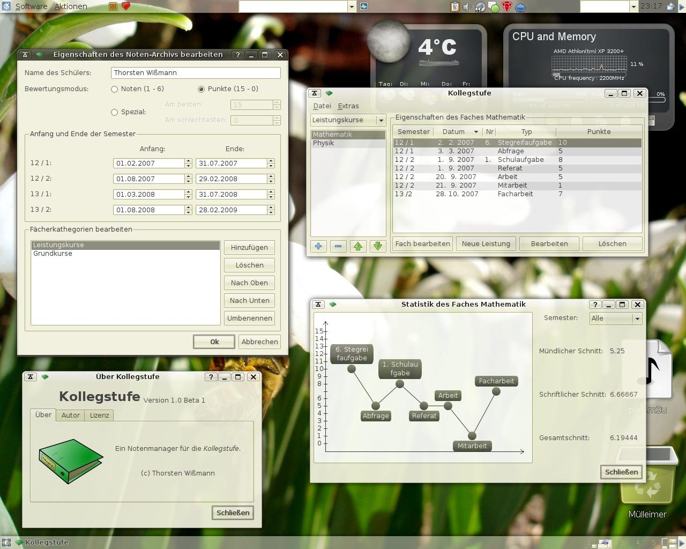

# kollegstufe

A qt4 software for handling your own grades at school.
I wrote the software during my final years at school (2007 to 2009).
The name `kollegstufe` refers to the final two years in Bavarian school before
reaching A-levels.

## git history

Back then, I did not know how to use git, so I've just created snapshots
of the file system after bigger changes. Now in 2022, I've created git
commits for the respective snapshots. Roughly, each commit was created by the
following commands:

```zsh
d=kollegstufeBU20080103  # the name of the snapshot directory
rm -f $(git ls-files|grep -v ^pic/screenshots/) ; # remove all files in git in order to keep track of renames/removes
cp -ra ~/dev/c/kdevelop/$d/* ./  ;
date=${d#kollegstufeBU}; date=${date%unstable} ; date="${date[0,4]}-${date[5,6]}-${date[7,8]}" ;
git add . ; git commit -a --date="$date" -m "Import ${date}"$'\n\n'"Source directory: $d"
```

## screenshots




